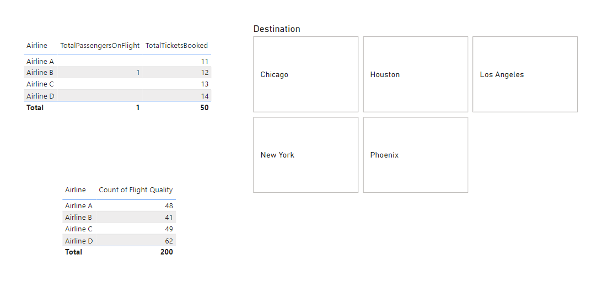
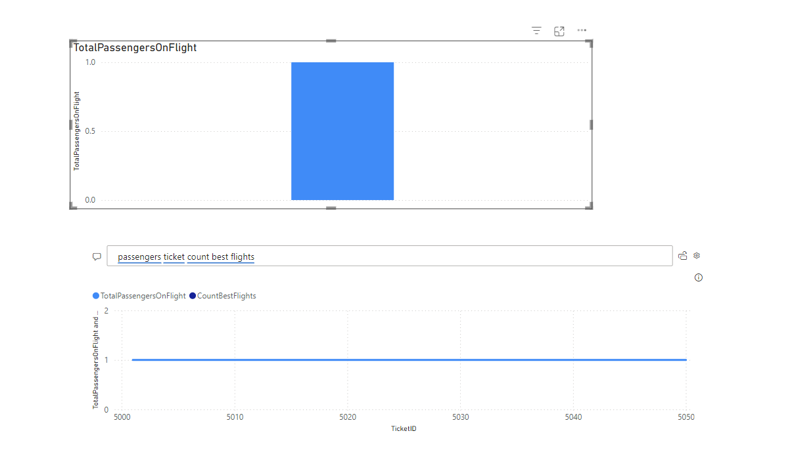

# Airline-Performance-Analysis-PowerBI
A Power BI project analyzing airline performance and passenger management.

**Introduction**
This project is designed to analyze key aspects of airline operations, including flight scheduling, passenger management, and ticket bookings, with the goal of streamlining processes and improving management insights. By harnessing Power BI's analytical and visualization capabilities, this analysis will reveal operational bottlenecks, booking trends, and other data-driven insights that are essential for improving airline performance and customer satisfaction.

**Problem Statement**
In the highly dynamic airline industry, managing operations efficiently is essential for maintaining customer satisfaction and ensuring strategic, data-driven decisions. With daily operations spanning flight scheduling, ticketing, and passenger management, it becomes challenging to keep track of performance metrics and make timely adjustments. By leveraging data analysis and visualization, we aim to enable better-informed decisions and operational improvements.

**Objective**
The primary objective of this project is to:
1. Analyze flight performance metrics, passenger data, and ticketing statuses.
2. Utilize Power BI to create an interactive dashboard that provides real-time insights.
3. Enable stakeholders to make informed decisions on improving flight punctuality, passenger satisfaction, and ticket booking processes.

**Datasets**
1. **Flight Information**: Contains details of each flight, including attributes such as `FlightID`, `FlightNumber`, `Airline`, `Destination`, and `Status`.
2. **Passenger Information**: Includes data on passengers, such as `PassengerID`, `FlightID`, and `SeatNumber`, allowing us to map passengers to flights.
3. **Ticket Information**: Details of ticket bookings, with fields like `TicketID`, `FlightID`, and `BookingStatus` to track booking trends and completion rates.

**Tasks/Features**
1. **Data Extraction and Transformation**: 
   - Load the datasets into Power BI and perform data cleaning, including handling duplicates and formatting columns.
2. **Conditional and Custom Columns**: 
   - Create custom columns to classify flight performance as “best” or “to be improved” based on on-time status.
3. **Merge Queries and Columns**: 
   - Combine datasets, such as merging Flight Information with Passenger Information by `FlightID`.
4. **DAX Calculations**:
   - Calculate metrics like total passengers per flight, total tickets booked, and create a filtered view of best-performing flights.
5. **Visualizations**:
   - Create a multi-card chart for passenger and flight counts, a bar chart comparing passengers by airline, and a donut chart showing booking statuses.
6. **Advanced Visualizations**:
   - Utilize a decomposition tree to analyze flights by airline and destination, and enable the Q&A feature to interact with booking data.
7. **Interactive Features**:
   - Implement slicers, bookmarks, and drill-throughs for dynamic data exploration and report navigation.
8. **Final Report and Dashboard**:
   - Design a user-friendly dashboard with a summary of insights, Q&A for instant answers, and role-based access to Airline A data. Schedule daily data refreshes.

**Key Findings and Insights**
- **On-Time Performance**: Airlines with high on-time performance are identified, allowing management to recognize and reward efficiency.
- **Passenger Distribution**: Visualizations highlight passenger volume across different airlines, helping in resource allocation and marketing decisions.
- **Booking Trends**: Analysis of booking statuses reveals patterns and areas for improvement, guiding efforts to reduce cancellations or delays.
- **Destination Patterns**: Popular destinations are analyzed, providing insights for route optimization and strategic growth.

